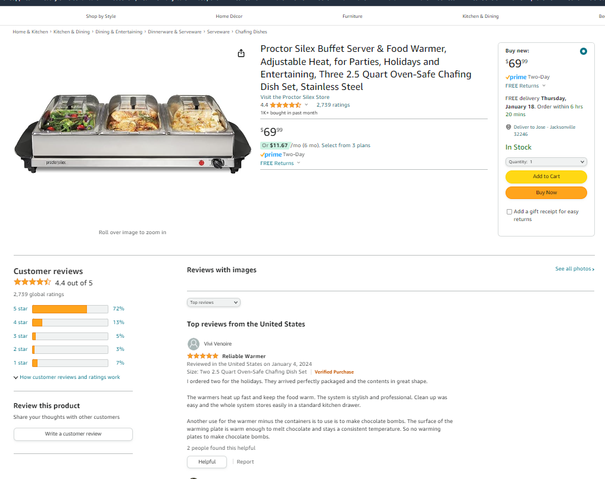

## Assignment 1
The currently GitHub repository contains a Readme file with the assignment instructions and a folder called assets where you can place images you need on your web page and an index.html blank page that should be used to write your app/ page.

You can commit your code to GitHub as often as you'd like without issues. When you feel like you are done, come to CANVAS and submit your Repository URL for me to grade.

## The purpose of this first assignment is to get used to the tools available and basic syntax, as well as a refresher of HTML, CSS and JavaScript/TypeScript. Although other future assignments may build on each other, this one will not.

Write a simple static product review web page as outlined below:

**Note: This is fully client side (on the browser) there is no back end it is just HTML, CSS and TypeScript and DOM manipulation.**

* The page will be for a product listing of your choice. It can be something simple but should include a production description, image (your own not mine) and star rating based on the number of reviews submitted. Note: there won’t be a way to store the reviews so when the page first loads the product’s star rating should be set at 0 (no stars).
* There should be a button for users to leave a rating (1-5 stars), an optional comment and their name (required). Make sure you provide basic error checking and input validation.
* After the user submits their review, it should be appended to the bottom of the review section and should include their rating, comment, name and date of posting. The star rating average should then be re-calculated and displayed at the top to account for this new rating.
* The code for this application should be written using ONLY HTML, CSS and JavaScript / TypeScript.
* There won’t be any points deducted for poor style (ugly pages) but make sure you make an effort and do use CSS styles for all / most of the elements on the page or use page wide classes.
* The application should be turned in using Git.
* EXTRA CREDIT: Get the star rating to show partial stars in the average / top section (ex: 3.5 stars shows 3 stars and a half star).
Here's a Mockup of what that Page could look like
